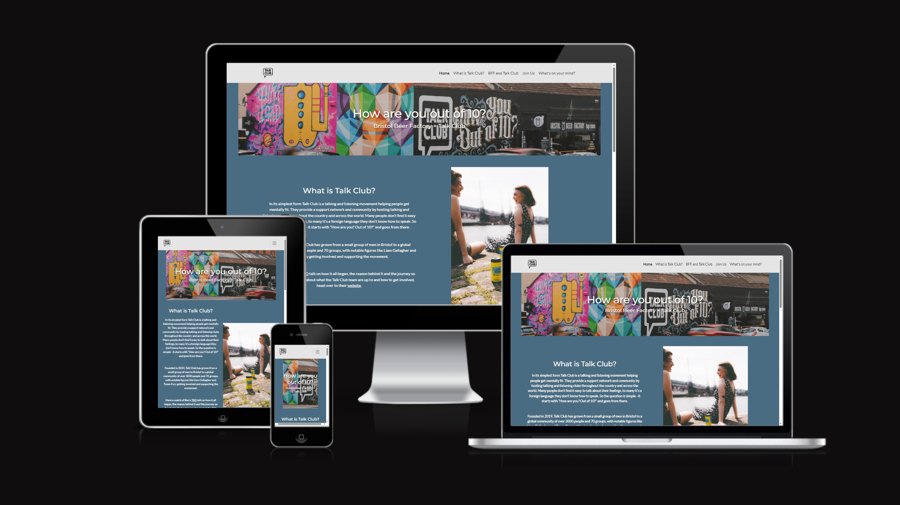

# A site for the collaboration between the Talk Club charity and the Bristol Beer Factory

# User goals
- Raise awareness of Talk Club abd specifically the original chapter at the BFF Taproom in Bedminster, Bristol.
- Send a clear message about the time and location of the Talk Club meetings.
- Get user to send us messages if in need. 

## Deployed site
 https://vcarpentier.github.io/talk-club/

## Source
 https://www.bristolbeerfactory.co.uk/pages/clear-head

# Responsiveness

# Validation

# Known issues
- Navbar is too tall
- Images stack up when on small devices (design issue)
- Bad alignment when jumping to section from navbar